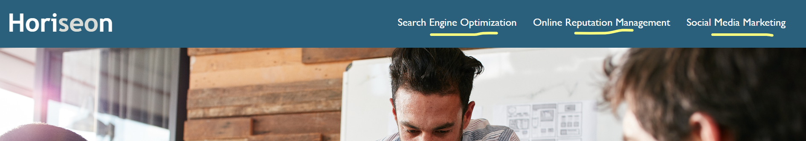

# horiseon-code-refractor
Code refractor

## Description
This project consists of optimizing the HTML and CSS files to comply with accessibility standards and for SEO purposes. With the new code, users with disabilities will be able to navigate the website and have the best user experience.

## Visuals
Horiseon website URL: https://nicolesang.github.io/horiseon-code-refractor/

- The full landing page will look like this:

## Usage
Clicking on any of the three options in the navigation bar will lead the user to the corresponding article on the webpage.

## Authors and acknowledgment
N/A

## License
MIT License

Copyright (c) [2023] [Karen Nicole Santamaria Granizo]

Permission is hereby granted, free of charge, to any person obtaining a copy
of this software and associated documentation files (the "Software"), to deal
in the Software without restriction, including without limitation the rights
to use, copy, modify, merge, publish, distribute, sublicense, and/or sell
copies of the Software, and to permit persons to whom the Software is
furnished to do so, subject to the following conditions:

The above copyright notice and this permission notice shall be included in all
copies or substantial portions of the Software.

THE SOFTWARE IS PROVIDED "AS IS", WITHOUT WARRANTY OF ANY KIND, EXPRESS OR
IMPLIED, INCLUDING BUT NOT LIMITED TO THE WARRANTIES OF MERCHANTABILITY,
FITNESS FOR A PARTICULAR PURPOSE AND NONINFRINGEMENT. IN NO EVENT SHALL THE
AUTHORS OR COPYRIGHT HOLDERS BE LIABLE FOR ANY CLAIM, DAMAGES OR OTHER
LIABILITY, WHETHER IN AN ACTION OF CONTRACT, TORT OR OTHERWISE, ARISING FROM,
OUT OF OR IN CONNECTION WITH THE SOFTWARE OR THE USE OR OTHER DEALINGS IN THE
SOFTWARE.

